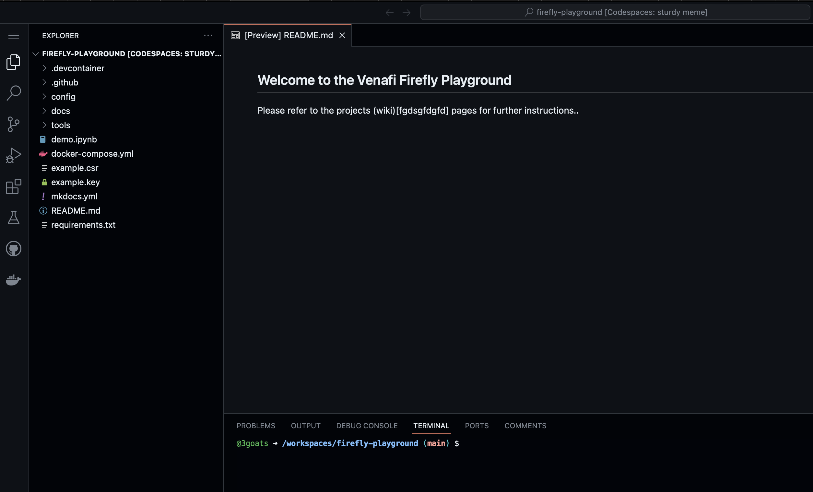

# Getting started with the Venafi Firefly Playground.

## Overview 

This quick-start playground is intended to showcase Venafi's {{ component_name }} ephemeral CA in the shortest possible time. Assuming the following prerequisites, it should take less than 60 seconds to deploy a fully functioning {{ component_name }} instance in a Github CodeSpaces or local Docker environment. 

### Prerequisites 

This playground can be run in one of two ways as follows: 

| Option      | Description                          |
| ----------- | ------------------------------------ |
| :octicons-codespaces-24:  GitHub CodeSpaces  | This is the quickest and easiest way to get started as there are no local dependencies. The codespace includes everything you need to try Firefly in your own GitHub dev container.   |
| :simple-docker: Local Docker       |  This option can be used to run Firefly on your local machine and has additional dependencies   |


* Run directly from GitHub CodeSpaces - no local dependencies
* Clone the repository and run in your own Docker environment - with local dependencies 
  ffdsfds


!!! Dependencies

    === "Run Playground in GitHub CodeSpaces"

        The following prerequisites can be used to run the {{ component_name }} playground in a GitHub CodeSpaces environment. This easiest and quickest way to get started and has no local dependencies and can be run entirely in a browser. 

        ---
        
        * A working GitHub account 
        * Venafi Cloud account for {{ component_name }} - you can signup for a free 30 day trial [here](https://venafi.com/try-venafi/firefly/)
        * An API key for your Venafi Cloud account. Use the instructions in the info panel below to get your API key.
          

    
    
    === "Run Playground in local Docker environment"

        The following prerequisites can be used to run the Firefly playground in your own Docker environment. This option has has mandatory and some optional local dependencies.

        ---
        
        *  Access to a fairly recent Docker runtime environment 
        *  Venafi Cloud account for Firefly - you can signup for a free 30 day trial [here](https://venafi.com/try-venafi/firefly/)
        * An API key for your Venafi Cloud account. Use the instructions in the info panel below to get your API key.
        * The following utilities are not required to run the Firefly playground but are used as a convenience to quickly demonstrate the Firefly API.     
            * Locally installed (cURL)[https://curl.se] command line utility
            * Locally installed (JQ)[https://jqlang.github.io/jq/] command line utility
            * Locally installed (OpenSSL)[https://www.openssl.org] command line utility
            * Locally installed (JWT)[https://github.com/mike-engel/jwt-cli] command line utility

        
??? info "Getting an API Key"

    If you don't have an API key you can follow this steps: 

    1. Login to https://ui.venafi.cloud. If you don't already have an account you can sign-up for a 30 day trail. 
    2. In the menu bar, click your **avatar** in the top-right corner, and then click **Preferences**. <figure markdown>
      { width="300" }
      </figure>
    3. Click the "Generate New Key" link, then specify the "API Key Validity Period". Recommend 30 days. <figure markdown>
      { width="300" }
      </figure>
    4. Click the "Generate" button at the bottom of the page. You will then see options to view or copy the new key. Keep a note of the API key somewhere secure for later<figure markdown>
      { width="300" }
      </figure>


        
## Audience

The intended audience for this playground is: 

* New or existing Venafi customers wanting to quickly see Firefly working within their own environments.
* InfoSec teams wanting to learn more about service that they can provide to cloud native developers, SRE's and platform engineering teams.
* Developers, SRE's and platform engineering teams wanting to learn more about the services that Info Sec teams should be providing 
* Internal Venafi staff wanting to demonstrate Firefly to partners and customers.

## Getting Started

The quick-start demo runs entirely in Docker and consists of three container images that a pulled from the public Docker repositories. 

:octicons-container-24: &nbsp; *3goats/elevate* - This a utility application that automates all of the required Venafi SaaS (control plane tasks) that would ordinarily be performed by an InfoSec team. Whilst these tasks can be performed manually, the utility helps by fully automating the configuration, thus new users get to see Firefly working much quicker.

:octicons-container-24: &nbsp; *tr1ck3r/jwt-this* - **jwt-this** (pronounced "jot this") is a command line utility I created to simplify demonstration, evaluation, and simple testing with Venafi Firefly. When run, it generates a new signing key pair, uses it to sign and output a new JSON Web Token (JWT) containing specified *Firefly*-related claims, and starts a basic HTTP server (listening on port 8000 by default) where the signing public key is published via a JSON Web Key Set (JWKS) so it can be used by *Firefly* to verify the signature of the JWT.

:octicons-container-24: &nbsp; *public.ecr.aws/venafi-images/firefly* - This is the main Firefly instance that will be initialised for the demonstration

To start the demo using Github CodeSpaces, use the steps in following info panel.

??? info "Launching the Firefly Playground using Github CodeSpaces"

    A codespace is a development environment that's hosted in the cloud. The {{ component_name }} playground GitHub repository provides a custom dev container that includes all of the prerequisites that are required:

    1. Login to your GitHub account and goto https://github.com/Venafi/firefly-playground
    2. Create a new CodeSpace by clicking on the "Code" button, then "Create codespace on main" e.g. <figure markdown>
    { width="400" }
    </figure>

    3. This will build and launch a new dev container which will take a few minutes to complete. You should then see a new development environment. e.g. <figure markdown>
    { width="400" }
    </figure>


## Running the Firefly Demo

To simplify the this demonstration, the project includes an interactive Jupyter (formerly IPython Notebook) notebook that includes all of the required commands. However, please note that this does not include some of the Docker commands which must be run from the terminal. To continue open the `demo.ipynb` file and follow the steps from there. 

???+ warning "Important"

    Before you can run Firefly, you must edit the `.env` file to include a valid Venafi cloud API key (referenced in the prerequisites) at the placeholder. This is the only thing you need to change.

    The first task in the demo creates a `.env` file that is used to store a variable for the API key.

    e.g. 

    ```text title="create a .env file"
    echo "TLSPC_API_KEY=xxxxx-xxxxxx-xxxxxx-xxxxxx" > .env
    ```

At this point you can either follow the instructions here and cut/past the commands into the terminal in the codesdpace, or just step through and run each of the cells in the `demo.ipynb` interactive notebook file.

### Step 1 - Configure the control plane

Every Firefly instance requires a valid service account, configuration and policy in the Venafi Control Plane (TLS Protect Cloud). For production, this task would often be completed by your InfoSec team. However, it might be undertaken by the platform engineering teams. Either way, you need to login to https://ui.venafi.cloud to create various config items. 

To simplify this process and reduce the time it takes to get started, we will use the prebuilt `3goats/elevate` container that fully automates the creation of the service account, configuration and policy. It will also create a private key file `private-key.pem` and local firefly `config.yaml` in the `config` directory.  

To do this use the following `docker compose` command. This will run only the `3goats/elevate` container.

???+ warning "Important"

    Do not run the `docker` commands in the interactive `demo.ipynb` environment. Instead type or cut and past the commands into the terminal. 

``` bash title="Configure the Control Plane"
docker compose --profile control-plane up
```

You should see the following output. You should also the following new files in the  `./config` directory. 

```bash title="Example output"
[+] Running 2/0
 ✔ Network firefly-quickstart_default      Created  0.0s 
 ✔ Container firefly-quickstart-elevate-1  Created  0.0s 
Attaching to elevate-1
elevate-1  | 
elevate-1  | bootstrap:
elevate-1  |   vaas:
elevate-1  |     url: https://api.venafi.cloud # (1)
elevate-1  |     auth:
elevate-1  |       privateKeyFile: /etc/firefly/private-key.pem  # (2)
elevate-1  |       clientID: 8104b51c-bf7e-11ee-9c78-4a98e9dd68c7  # (3)
elevate-1  |     csr:
elevate-1  |       instanceNaming: SKO Demo # (4)
elevate-1  | server: # (5)
elevate-1  |   rest: # (6)
elevate-1  |     port: 8281 # (7)
elevate-1  |     tls: # (8)
elevate-1  |       dnsNames: # (9)
elevate-1  |       - firefly.venafi.example
elevate-1  |       ipAddress: 127.0.0.1 # (10)
elevate-1  | 
elevate-1 exited with code 0
```

1.  :fontawesome-solid-circle-info: This is the url for the Venafi control plane API.
2.  :fontawesome-solid-circle-info: The path to the private key that will be used to authenticate the Firefly instance to the Venafi control plane. The corresponding public key is stored in the control plane definition for the service account.
3.  :fontawesome-solid-circle-info: This is a reference to the `clientID` that will be used to authenticate the Firefly instance.
4.  :fontawesome-solid-circle-info: A name that will be used to identify the Firefly instance in the control plane.
5.  :fontawesome-solid-circle-info: Firefly will run in server mode and expose networking ports. Firefly can also run in Kubernetes operator mode and will not expose networking ports.
6.  :fontawesome-solid-circle-info: Firefly will expose a REST API. Firefly supports REST, GraphQL and gRPC.
7.  :fontawesome-solid-circle-info: The port used for the REST API.
8.  :fontawesome-solid-circle-info: Define the TLS configuration for the REST API.
9.  :fontawesome-solid-circle-info: A list of FQDN's that will be included in the auto generated TLS certificate used for the REST API.
10. :fontawesome-solid-circle-info: The IP address used for the REST API.


!!! note "Firefly Configuration file"

    C9ick on the `+` symbols in the output above to learn more about how Firefly uses the local `config.yaml` file. 

The following files will also be updated to include valid content. 

*  **config.yaml** - This is a generated Firefly configuration that will be used to pass the Firefly instance some basic values that are required as part of the bootstrap process,
* **private-key.pem** This is the private part of a generated key pair that will be used by firefly to authenticate to the Venafi Cloud control plane.  

### Step 2 - Start Firefly and the local JWT service

Now that we've configured the Control Plane, we can now start the Firefly container `public.ecr.aws/venafi-images/firefly` and the `tr1ck3r/jwt-this`. 

To do this use the following `docker compose` command. The `--profile demo` flag tells Docker to run only the `public.ecr.aws/venafi-images/firefly` and the `tr1ck3r/jwt-this` containers.

``` bash title="Start Firefly & the JWT service"
docker compose --profile demo up
```

You should see the following output. 

```bash title="Example output"
todo
.........
.........
.........
```

!!! note 

    The above command runs docker in interactive mode which means that the process does not exit.

### Step 3 - Request a certificate 

