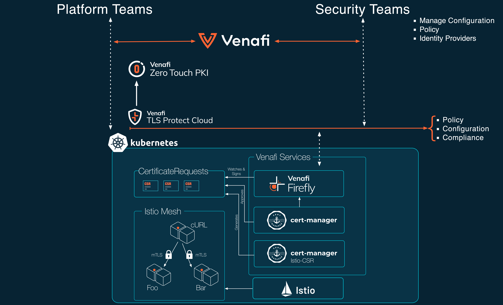
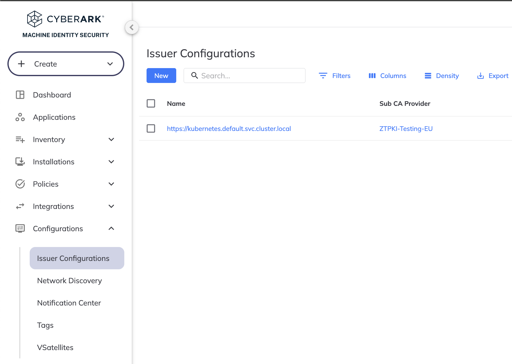
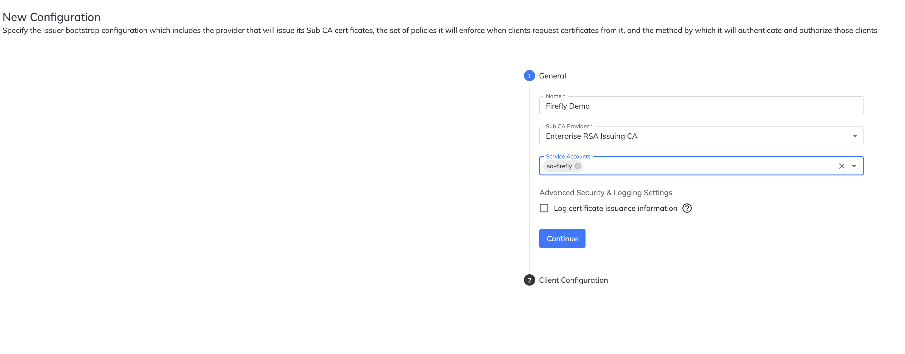
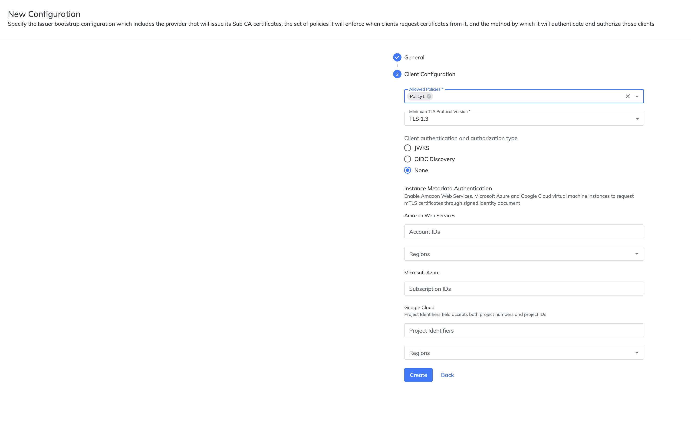

# Firefly with Istio demo steps

```sh
kubectl config use-context kind-demo-cluster-base-istio 
kubectl config get-contexts
```

# Architecture



# Create a new Kubernetes cluster

Lets create a new Kubernetes cluster. You can use [KIND](https://kind.sigs.k8s.io) or [K3D](https://k3d.io/stable/).

## Step 1. Create the cluster

```sh
//k3d cluster create demo-cluster-1 --volume /Users/carl.bourne/development/Istio-firefly/config:/config
kind create cluster --name demo-cluster-2
```

## Step 2. Get cluster information

```sh
kubectl cluster-info
```

```sh
kubectl config get-contexts
```

## Step 3. Install cert-manager

```sh
# Install cert-manager
kubectl apply -f https://github.com/cert-manager/cert-manager/releases/download/v1.12.0/cert-manager.yaml
```

## Step 4. Create a new Venafi namespace

```sh
# Create Venafi namespace
kubectl create ns venafi
```

## Step 5. Store the trust chain bundle for either the TLSPC built in CA or ZTPKI as a generic secret

```sh
# Store the certificate chain in K8s secrets 
# Remember to use either the ztpki_certificate_chain.cer for ZTPKI or the built-in_certificate_chain.cer cert chains depending on the Firefly configuration. 
kubectl create secret generic -n cert-manager root-cert --from-file=root-cert.pem=../crypto/ztpki_certificate_chain.cer
```

## Step 6. Create a new Venafi Service Account

```sh
$(venctl iam service-accounts firefly create --name sa-firefly --api-key d6153163-a2d6-44a5-a226-7f9943d30923 --output json --output-file venafi-sa-creds.json  )
#$(venctl iam service-accounts firefly create --name sa-firefly --api-key d6153163-a2d6-44a5-a226-7f9943d30923 --output json)
```

# Step 7 Create a new Firefly configuration

<style>
.row {
  display: flex;
}

.column {
  flex: 33.33%;
  padding: 1px;
}
</style>

<div class="row">
  <div class="column">
    
  </div>
  <div class="column">
    
  </div>
  <div class="column">
    
  </div>
</div>


## Step 8. Store the private key for the TLSPC service account as a generic secret

```sh
kubectl apply -f - <<EOF
apiVersion: v1
kind: Secret
metadata:
  name: venafi-credentials
  namespace: venafi
type: Generic
stringData: 
  svc-acct.key: $(cat venafi-sa-creds.json | jq '.. | select(.private_key?).private_key')
EOF
```

## Step 9.  Install Firefly using a Helm chart

```sh
# Install Firefly using the helm chart

helm upgrade prod oci://registry.venafi.cloud/public/venafi-images/helm/firefly \
  --set-string deployment.venafiClientID=$(cat venafi-sa-creds.json | jq '.. | select(.client_id?).client_id') \
  --install \
  --create-namespace \
  --namespace venafi \
  --values firefly-values.yaml \
  --version v1.5.1
```

## Step 10. Test Firefly using the cmctl command line

```sh
# Test Firefly using cmctl
cmctl create certificaterequest my-cr-test1 \
  --from-certificate-file certificate.yaml \
  --fetch-certificate
cat my-cr-test1.crt
```

```yaml
  # certificate.yaml
  kind: Certificate
  apiVersion: cert-manager.io/v1
  metadata:
    annotations:
      #firefly.venafi.com/policy-name: istio-mtls-certs
      firefly.venafi.com/policy-name: Firefly Playground
  spec:
    secretName: example-com-tls
    commonName: srvc.acme.com
    issuerRef:
      name: firefly
      kind: Issuer
      group: firefly.venafi.com
```

# Installing Istio

Now lets install Istio

## Step 1. Create a new namespace for Istio

```sh
kubectl create ns istio-system
```

## Step 2. Install Istio-CSR using Helm

```sh
#Install istio CSR
helm repo add jetstack https://charts.jetstack.io --force-update
helm upgrade -i -n cert-manager cert-manager-istio-csr jetstack/cert-manager-istio-csr -f istio-csr-values.yaml
#helm repo add jetstack https://charts.jetstack.io --force-update
```

```yaml
# istio-csr-values.yaml
replicaCount: 3
image:
  repository: quay.io/jetstack/cert-manager-istio-csr
  tag: v0.14.0
  pullPolicy: IfNotPresent
app:
  certmanager:
    namespace: istio-system
    preserveCertificateRequests: true
    additionalAnnotations:
    - name: firefly.venafi.com/policy-name
      value: istio-mtls-certs
    issuer:
      group: firefly.venafi.com
      kind: Issuer
      name: firefly-istio
  tls:
    trustDomain: cluster.local
    certificateDNSNames:
    # Name used by the e2e client
    - istio-csr.cert-manager.svc
    # Name used within the demo cluster
    - cert-manager-istio-csr.cert-manager.svc
    rootCAFile: /etc/tls/root-cert.pem
  server:
    maxCertificateDuration: 1440m
    serving:
      address: 0.0.0.0
      port: 6443
# -- Optional extra volumes. Useful for mounting custom root CAs
volumes:
- name: root-ca
  secret:
    secretName: root-cert

# -- Optional extra volume mounts. Useful for mounting custom root CAs
volumeMounts:
- name: root-ca
  mountPath: /etc/tls
```

## Step 3. Install Istio

```sh
#Install Istio
istioctl install -f istio-config.yaml -y
#istioctl upgrade
```

```yaml
# istio-config.yaml
apiVersion: install.istio.io/v1alpha1
kind: IstioOperator
metadata:
  namespace: istio-system
spec:
  profile: "demo"
  hub: gcr.io/istio-release
  meshConfig:
    # Change the following line to configure the trust domain of the Istio cluster.
    trustDomain: cluster.local
  values:
    global:
      # Change certificate provider to cert-manager istio agent for istio agent
      caAddress: cert-manager-istio-csr.cert-manager.svc:443
  components:
    pilot:
      k8s:
        env:
          # Disable istiod CA Sever functionality
        - name: ENABLE_CA_SERVER
          value: "false"
        overlays:
        - apiVersion: apps/v1
          kind: Deployment
          name: istiod
          patches:

            # Mount istiod serving and webhook certificate from Secret mount
          - path: spec.template.spec.containers.[name:discovery].args[-1]
            value: "--tlsCertFile=/etc/cert-manager/tls/tls.crt"
          - path: spec.template.spec.containers.[name:discovery].args[-1]
            value: "--tlsKeyFile=/etc/cert-manager/tls/tls.key"
          - path: spec.template.spec.containers.[name:discovery].args[-1]
            value: "--caCertFile=/etc/cert-manager/ca/root-cert.pem"

          - path: spec.template.spec.containers.[name:discovery].volumeMounts[-1]
            value:
              name: cert-manager
              mountPath: "/etc/cert-manager/tls"
              readOnly: true
          - path: spec.template.spec.containers.[name:discovery].volumeMounts[-1]
            value:
              name: ca-root-cert
              mountPath: "/etc/cert-manager/ca"
              readOnly: true

          - path: spec.template.spec.volumes[-1]
            value:
              name: cert-manager
              secret:
                secretName: istiod-tls
          - path: spec.template.spec.volumes[-1]
            value:
              name: ca-root-cert
              configMap:
                defaultMode: 420
                name: istio-ca-root-cert
```

```sh
# Enable istio side-car injection 
#kubectl label namespace legacy istio-injection=enabled
kubectl label namespace foo istio-injection=enabled
kubectl label namespace bar istio-injection=enabled
#kubectl label namespace bookinfo istio-injection=enabled
```

# Install Some Demo Apps

```sh
kubectl create ns foo
kubectl create ns bar
kubectl apply -f <(istioctl kube-inject -f https://raw.githubusercontent.com/istio/istio/refs/heads/master/samples/httpbin/httpbin.yaml) -n bar
kubectl apply -f <(istioctl kube-inject -f https://raw.githubusercontent.com/istio/istio/refs/heads/master/samples/curl/curl.yaml) -n bar


```

## Inspect the Secret

Replace 

```sh
istioctl pc secret  $(kubectl get pod -n bar -l app=httpbin -o jsonpath={.items..metadata.name}) \
    -n bar -o json | \
    jq -r '.dynamicActiveSecrets[0].secret.tlsCertificate.certificateChain.inlineBytes' | \
    base64 --decode | 
```