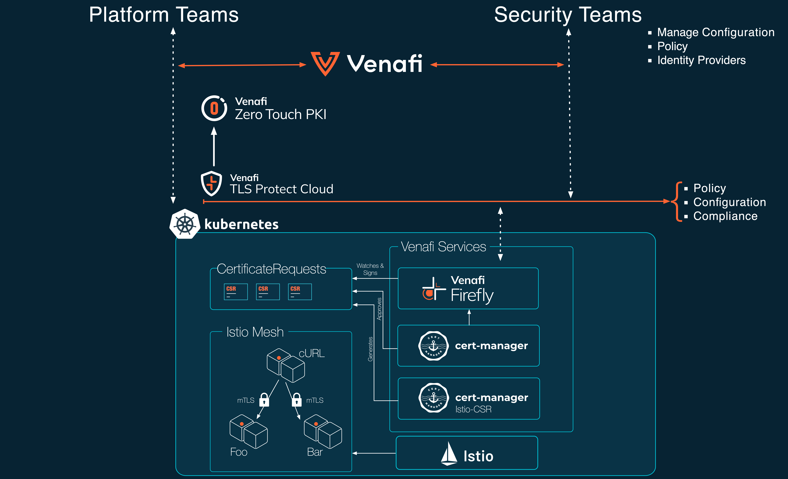
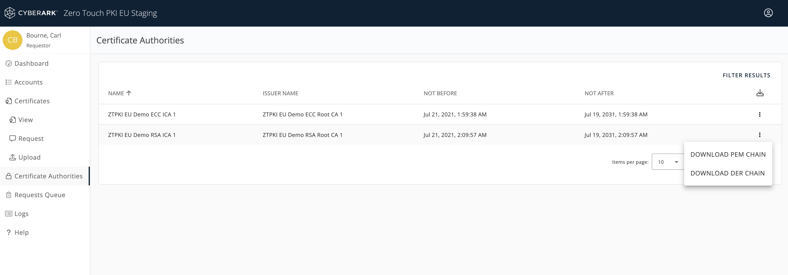
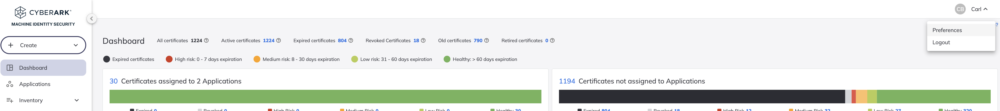
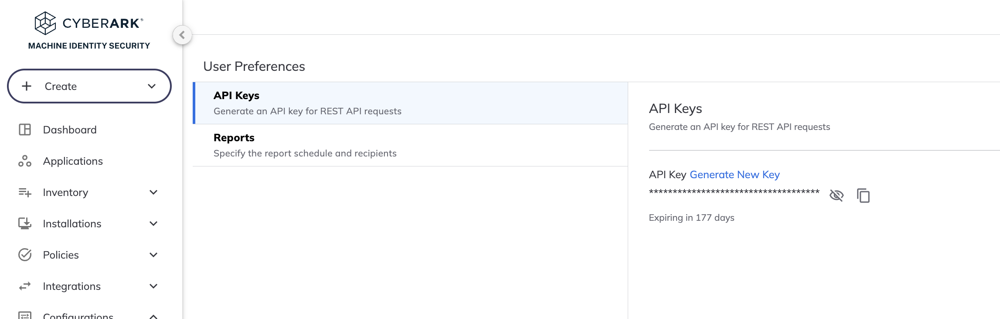
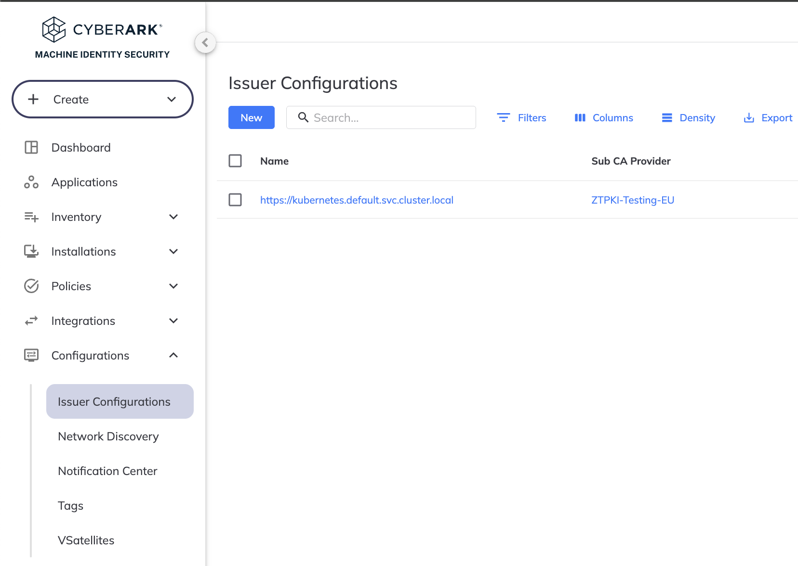
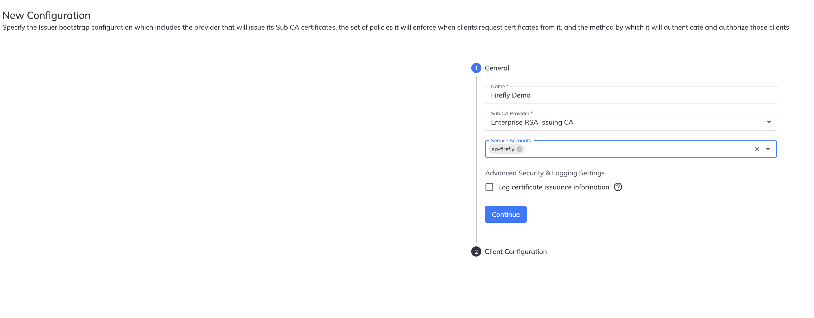
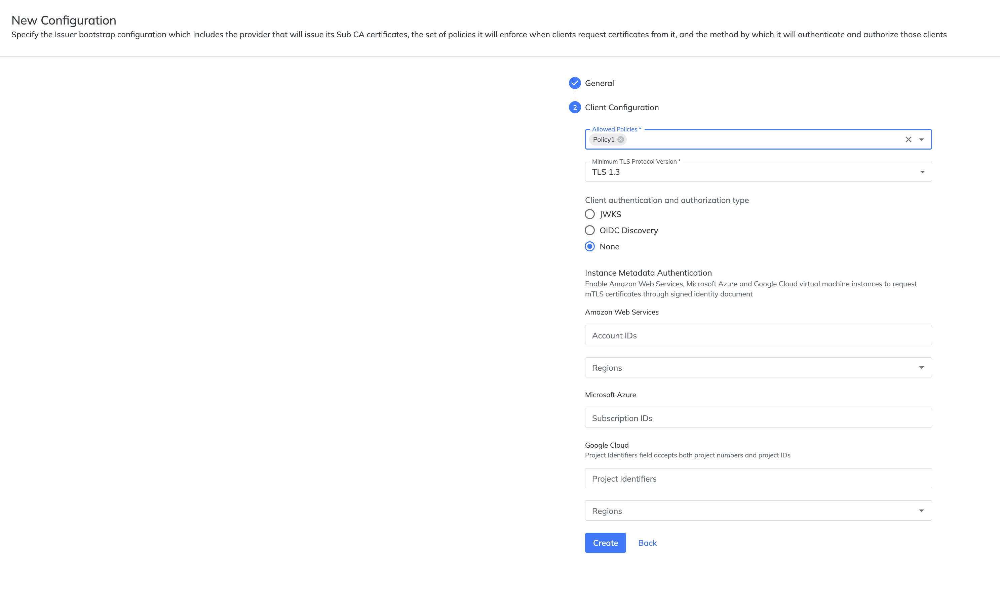

# Firefly with Istio demo steps

This document can be used as quick evaluation guide that showcases how CyberArk WorkLoad Identity Issuer easily integrates with Istio service-mesh. 

!!! warning 

      This document is currently a working draft and assumes some knowledge of Kubernetes. There my some inaccuracies and errors. It is intended to provide Information Security and platform teams with a quick overview for integrating CyberArk's Workload Identitiy Issuer with 'cert-manager` and `Istio` service-mesh. It is NOT intended to be used for production purposes.

```sh
kubectl config use-context kind-demo-cluster-istio-doc-testing
kubectl config get-contexts
```

# Architecture


<style>
.row {
  display: flex;
}

.column {
  flex: 33.33%;
  padding: 1px;
}
</style>

<div class="row">
  <div class="column">
    
  </div>
</div>

!!! info "Prerequisites" 

      To complete this quick-start you will need to ensure that the following utilities are installed: 

      - **`venctl`** A CLI tool that enables interaction with CyberArk Certificate Manager from the command line. You can install it from here: https://docs.venafi.cloud/vaas/venctl/t-venctl-install/
      - **`jq`** A lightweight CLI tool and flexible command-line JSON processor. You can install it from here: https://jqlang.org
      - **`cmctl`** A command line tool that can help you manage cert-manager and its resources inside your cluster. You can install it from here: https://cert-manager.io/docs/reference/cmctl/#installation

Lets create a new Kubernetes cluster. You can use [KIND](https://kind.sigs.k8s.io).

### Step 1. Create the cluster (Optional)

```sh
kind create cluster --name kind-demo-cluster-istio-demo 
```

### Step 2. Get cluster information (Optional)

```sh
kubectl cluster-info
```

### Step 3. Install cert-manager

```sh
# Install cert-manager
kubectl apply -f https://github.com/cert-manager/cert-manager/releases/download/v1.12.0/cert-manager.yaml
```

### Step 4. Create a new Venafi namespace

```sh
# Create Venafi namespace
kubectl create ns venafi
```

### Step 5. Get the trust bundle and store it as a Kubernetes generic secret

Login in to your're ZTPKI instance and get download the PEM chain for your CA.

<style>
.row {
  display: flex;
}

.column {
  flex: 33.33%;
  padding: 1px;
}
</style>

<div class="row">
  <div class="column">
    
  </div>
</div>

```sh
kubectl create secret generic -n cert-manager root-cert --from-file={replace with pem chain filename} 

```

### Step 6 Get an API Key and create an environment variable

<style>
.row {
  display: flex;
}

.column {
  flex: 33.33%;
  padding: 1px;
}
</style>

<div class="row">
  <div class="column">
    
  </div>
  <div class="column">
    
  </div>
</div>

```sh
export API_KEY= {paste api key from above}
```

### Step 7. Create a new Venafi Service Account

```sh
$(venctl iam service-accounts firefly create --name sa-firefly-1 --api-key $API_KEY --output json --output-file venafi-sa-creds.json  )
```

### Step 8 Create a new Firefly configuration

<style>
.row {
  display: flex;
}

.column {
  flex: 33.33%;
  padding: 1px;
}
</style>

<div class="row">
  <div class="column">
    
  </div>
  <div class="column">
    
  </div>
  <div class="column">
    
  </div>
</div>

### Step 9. Store the private key for the TLSPC service account as a generic secret

```sh
kubectl apply -f - <<EOF
apiVersion: v1
kind: Secret
metadata:
  name: venafi-credentials
  namespace: venafi
type: Generic
stringData: 
  svc-acct.key: $(cat venafi-sa-creds.json | jq '.. | select(.private_key?).private_key')
EOF
```

### Step 10.  Install Firefly using a Helm chart

```sh
helm upgrade prod oci://registry.venafi.cloud/public/venafi-images/helm/firefly \
  --set-string deployment.venafiClientID=$(cat venafi-sa-creds.json | jq '.. | select(.client_id?).client_id') \
  --install \
  --create-namespace \
  --namespace venafi \
  --values firefly-values.yaml \
  --version v1.5.1
```

### Step 11. Test Firefly using the cmctl command line

```sh
cmctl create certificaterequest my-cr-test1 --from-certificate-file - --fetch-certificate  <<EOF
  kind: Certificate
  apiVersion: cert-manager.io/v1
  metadata:
    annotations:
      #firefly.venafi.com/policy-name: istio-mtls-certs
      firefly.venafi.com/policy-name: Firefly Playground
  spec:
    secretName: example-com-tls
    commonName: srvc.acme.com
    issuerRef:
      name: firefly
      kind: Issuer
      group: firefly.venafi.com
EOF
```

### Step 12. Create a new namespace for Istio

```sh
kubectl create ns istio-system
```

### Step 13. Install Istio-CSR using Helm

```sh
helm upgrade -i -n cert-manager cert-manager-istio-csr jetstack/cert-manager-istio-csr -f - <<EOF
replicaCount: 3
image:
  repository: quay.io/jetstack/cert-manager-istio-csr
  tag: v0.14.0
  pullPolicy: IfNotPresent
app:
  certmanager:
    namespace: istio-system
    preserveCertificateRequests: true
    additionalAnnotations:
    - name: firefly.venafi.com/policy-name
      value: istio-mtls-certs
    issuer:
      group: firefly.venafi.com
      kind: Issuer
      name: firefly-istio
  tls:
    trustDomain: cluster.local
    certificateDNSNames:
    # Name used by the e2e client
    - istio-csr.cert-manager.svc
    # Name used within the demo cluster
    - cert-manager-istio-csr.cert-manager.svc
    rootCAFile: /etc/tls/root-cert.pem
  server:
    maxCertificateDuration: 1440m
    serving:
      address: 0.0.0.0
      port: 6443
# -- Optional extra volumes. Useful for mounting custom root CAs
volumes:
- name: root-ca
  secret:
    secretName: root-cert

# -- Optional extra volume mounts. Useful for mounting custom root CAs
volumeMounts:
- name: root-ca
  mountPath: /etc/tls
EOF
```

### Step 14. Install Istio

```sh
istioctl install -y -f - <<EOF
# istio-config.yaml
apiVersion: install.istio.io/v1alpha1
kind: IstioOperator
metadata:
  namespace: istio-system
spec:
  profile: "demo"
  hub: gcr.io/istio-release
  meshConfig:
    # Change the following line to configure the trust domain of the Istio cluster.
    trustDomain: cluster.local
  values:
    global:
      # Change certificate provider to cert-manager istio agent for istio agent
      caAddress: cert-manager-istio-csr.cert-manager.svc:443
  components:
    pilot:
      k8s:
        env:
          # Disable istiod CA Sever functionality
        - name: ENABLE_CA_SERVER
          value: "false"
        overlays:
        - apiVersion: apps/v1
          kind: Deployment
          name: istiod
          patches:

            # Mount istiod serving and webhook certificate from Secret mount
          - path: spec.template.spec.containers.[name:discovery].args[-1]
            value: "--tlsCertFile=/etc/cert-manager/tls/tls.crt"
          - path: spec.template.spec.containers.[name:discovery].args[-1]
            value: "--tlsKeyFile=/etc/cert-manager/tls/tls.key"
          - path: spec.template.spec.containers.[name:discovery].args[-1]
            value: "--caCertFile=/etc/cert-manager/ca/root-cert.pem"

          - path: spec.template.spec.containers.[name:discovery].volumeMounts[-1]
            value:
              name: cert-manager
              mountPath: "/etc/cert-manager/tls"
              readOnly: true
          - path: spec.template.spec.containers.[name:discovery].volumeMounts[-1]
            value:
              name: ca-root-cert
              mountPath: "/etc/cert-manager/ca"
              readOnly: true

          - path: spec.template.spec.volumes[-1]
            value:
              name: cert-manager
              secret:
                secretName: istiod-tls
          - path: spec.template.spec.volumes[-1]
            value:
              name: ca-root-cert
              configMap:
                defaultMode: 420
                name: istio-ca-root-cert
EOF
```

### Step 15. Create a namespace and enable side-car injection

```sh
kubectl create ns bar
kubectl label namespace bar istio-injection=enabled
```

### Step 16. Install a demo App

```sh
echo "apiVersion: v1
kind: ServiceAccount
metadata:
  name: httpbin
---
apiVersion: v1
kind: Service
metadata:
  name: httpbin
  labels:
    app: httpbin
    service: httpbin
spec:
  ports:
  - name: http
    port: 8000
    targetPort: 8080
  selector:
    app: httpbin
---
apiVersion: apps/v1
kind: Deployment
metadata:
  name: httpbin
spec:
  replicas: 1
  selector:
    matchLabels:
      app: httpbin
      version: v1
  template:
    metadata:
      labels:
        app: httpbin
        version: v1
    spec:
      serviceAccountName: httpbin
      containers:
      - image: docker.io/mccutchen/go-httpbin:v2.15.0
        imagePullPolicy: IfNotPresent
        name: httpbin
        ports:
        - containerPort: 8080" > httpbin.yaml 
kubectl apply -n bar -f <(istioctl kube-inject -f httpbin.yaml ) 
```

### Step 17. Inspect the Secret
 

```sh
istioctl pc secret  $(kubectl get pod -n bar -l app=httpbin -o jsonpath={.items..metadata.name}) \
    -n bar -o json | \
    jq -r '.dynamicActiveSecrets[0].secret.tlsCertificate.certificateChain.inlineBytes' | \
    base64 --decode
```