# OpenShift cert-manager + CyberArk Workload Identity Issuer

!!! warning 

      This document is currently a working draft and assumes some knowledge of Kubernetes/OpenShift and there my some inaccuracies and errors. It is intended to provide Information Security and platform teams with a quick overview for integrating CyberArk's Workload Identity Issuer with 'cert-manager` and `Istio` service-mesh. It is NOT intended to be used for production purposes.

      Please also not that the original Venafi product names are currently transitioning to CyberArk therefore the document uses both Venafi and CyberArk interchangeably.


## Overview

This quick-start is intended to to provide a single point of reference for installing and configuring Firefly with cert-manager using the CyberArk OpenShift Operator.

It will include the following components:

- **Enterprise cert-manager:** Enterprise cert-manager adds certificates and certificate issuers as resource types in Kubernetes clusters, and simplifies the process of obtaining, renewing and using certificates. Venafi provides Long-Term Support (LTS) releases of cert-manager to help organizations with lifecycle planning. Each LTS release is maintained for a minimum of two years.
- **CyberArk Workload Identity Issuer:** A lightweight, distributed, and cloud-native machine identity issuer, specifically designed to secure workloads in dynamic, cloud-native environments.  

These enterprise components and are stored in a private repository.

Users in the US, Canada, Australia, and Singapore regions should use the US registry. Users in the EU and UK should use the EU registry:

- US: oci://private-registry.venafi.cloud/
- EU: oci://private-registry.venafi.eu/

!!! info "Prerequisites"

      To complete this quick-start you will need access to:
      
      - **A RedHat OpenShift Cluster** You will need permissions that enable you to install the "CyberArk Certificate Manager Operator" You can learn more here: https://catalog.redhat.com/en/software/container-stacks/detail/65ba7a33a723d0b8f2df84b4
      - **Access to a CyberArk Certificate Manager Tenant (Formally Venafi TLS Protect Cloud)** 
      - **Successfully Installed the CyberArk Certificate Manager Operator for OpenShift**
      
      You will also need to ensure that the following utilities are installed: 
    
      - **`kubectl`** The Kubernetes CLI tool. This needs to be configured with the correct context to access the OpenShift cluster.
      - **`venctl`** A CLI tool that enables interaction with CyberArk Certificate Manager from the command line. You can install it from here: https://docs.venafi.cloud/vaas/venctl/t-venctl-install/
      - **`imgpkg`** A CLI  tool that allows users to store a set of arbitrary files as an OCI image. You can install it from here: https://github.com/carvel-dev/imgpkg
      - **`jq`** A lightweight CLI tool and flexible command-line JSON processor. You can install it from here: https://jqlang.org
      - **`cmctl`** A command line tool that can help you manage cert-manager and its resources inside your cluster. You can install it from here: https://cert-manager.io/docs/reference/cmctl/#installation


??? abstract "Step 1. Install the "CyberArk Certificate Manager Operator for OpenShift"

    In this step we will create a new `cyberark` namespace within our OpenShift cluster and then install the CyberArk Certificate Manager Operator for OpenShift.
    
    **1. Create a new name-space**

    ```sh title="Command"
     kubectl create namespace cyberark
    ```

    **2. Install the OpenShift Operator**

    **a.** Login to your OpenShift Cluster Console and navigate to "Operators, OperatorHub" in the left hand menu. Then type "CyberArk" in the search field. (See Example 1.) </br>
    **b.** Click "Install" (See Example 2.) </br>
    **c.** Click on the "Installed Namespace" drop-down and select "CyberArk", then click "Install" (See Example 3.)

    <style>
    .row {
      display: flex;
    }

    .column {
      flex: 33.33%;
      padding: 5px;
    }
    </style>

    <div class="row">
      <div class="column">
      <caption>Example 1 :material-arrow-down-right:</caption>
        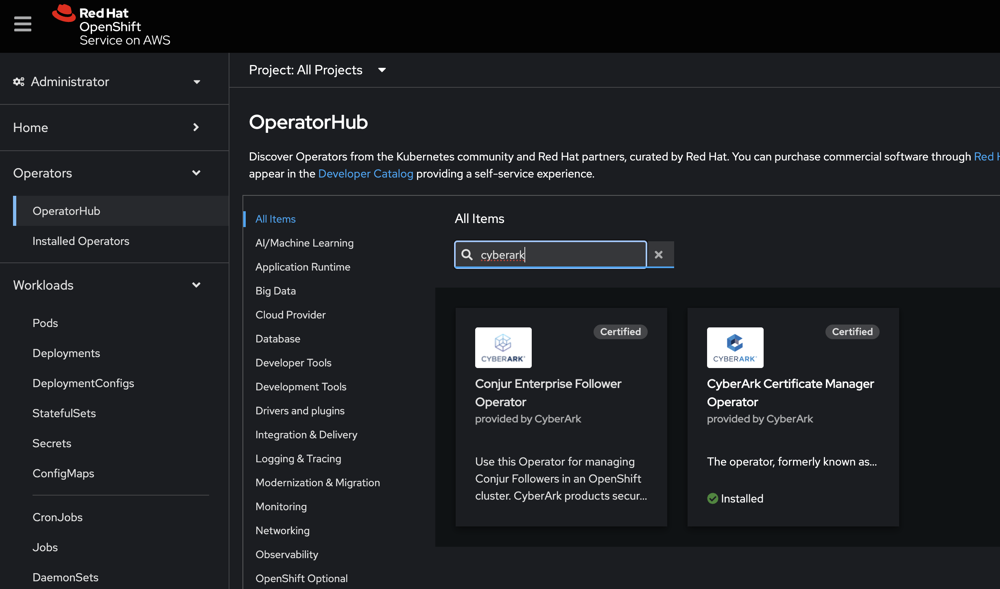
      </div>
      <div class="column">
      <caption>Example 2 :material-arrow-down-right:</caption>
        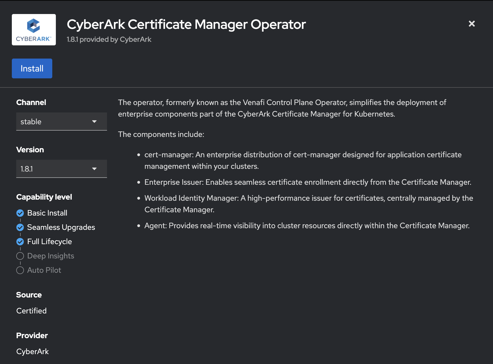
      </div>
           <div class="column">
           <caption>Example 3 :material-arrow-down-right:</caption>
        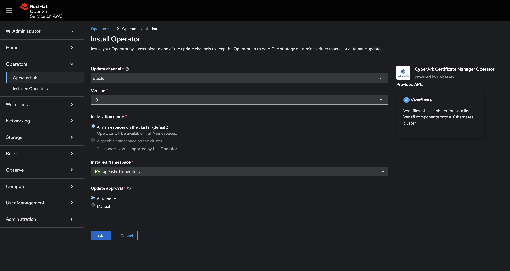
      </div>
      
    </div>

    Upon completion you should see:

     <style>
    .row {
      display: flex;
    }

    .column {
      flex: 33.33%;
      padding: 5px;
    }

    </style>

    <div class="row">
      <div class="column">
        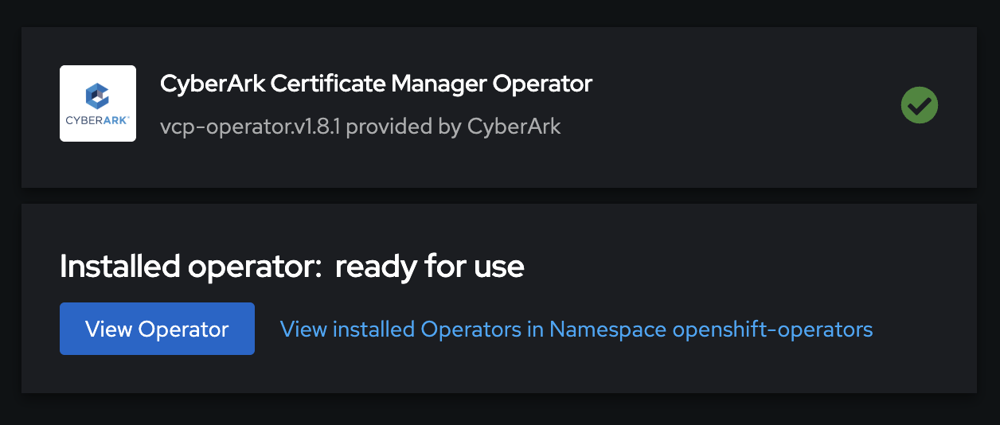
      </div>
      <div class="column">
      </div>
      <div class="column">
      </div>
    </div>


??? abstract "Step 2. Enable access to the private CyberArk OCI registry"

    In this step we will enable access to the private CyberArk OCI (Open Container Initiative) registry which stores the enterprise container images, Helm charts, and other artifacts. To save some time we'll use the `venctl` command line to get the credential. 

    This step also requires access to a system where `jq` and `kubectl` are installed.

    
    !!! note "A note about CyberArk OCI registries" 
    
          There are two types of registries: public and private.
    
          - **Public Registries:** These are deployed in all available Venafi Control Plane regions and serve from a single location: registry.venafi.cloud. Public registries hold publicly available artifacts and do not require authentication.
          - **Private Registries:** These registries store enterprise Venafi software and are available in region-specific locations.
          US region - private-registry.venafi.cloud
          EU region - private-registry.venafi.eu
          Users in the US, Canada, Australia, and Singapore regions should use the US registry. Users in the EU and UK should use the EU registry.
          Access to these registries requires a subscription to the Venafi Control Plane. For your convenience, the private registries also contain the public artifacts hosted by the public registries.
          There are two ways to acquire credentials to access the registry:
    
          - Using the Venafi Control Plane UI
          - Using the CLI tool for CyberArk Certificate Manager
              
          Users in the US, Canada, Australia, and Singapore regions should use the US registry. Users in the EU and UK should use the EU registry:
    
          - US: oci://private-registry.venafi.cloud/
          - EU: oci://private-registry.venafi.eu/     
     
    **1. Export the Venafi SaaS API Key**

    **a.** Login to the Venafi SaaS Console and navigate to "Account - Preferences" in the top right of the screen (See Example 1.) </br>
    **b.** Copy the API key to your clipboard (See Example 2.)

     <style>
    .row {
      display: flex;
    }

    .column {
      flex: 33.33%;
      padding: 5px;
    }
    </style>

    <div class="row">
      <div class="column">
      <caption>Example 1 :material-arrow-down-right:</caption>
        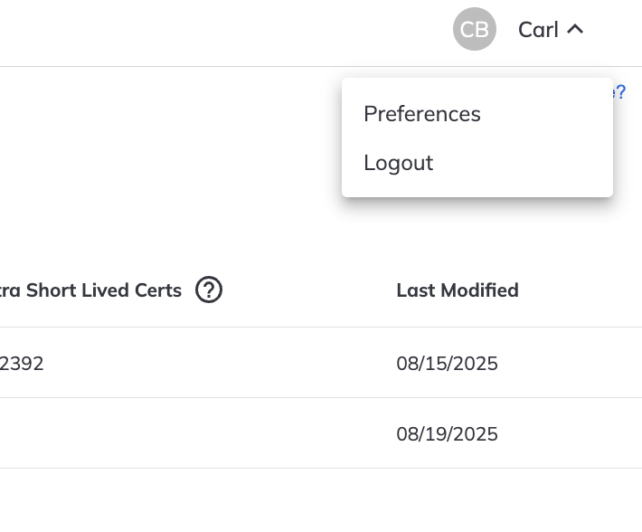
      </div>
      <div class="column">
      <caption>Example 2 :material-arrow-down-right:</caption>
       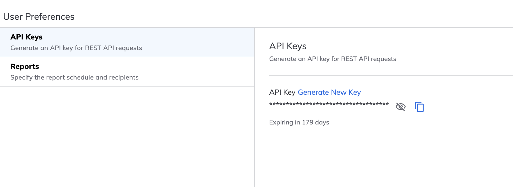
      </div>
           
      
    </div>

     **2. Save the API key as an environment variable**

    ```sh title="Command:"
    export API_KEY="content from clipboard"
    ```

     
    **3. Create an "image pull" credential**
     
     ```sh title="Command: Create an image pull credential"
     venctl iam service-accounts registry create --name "Enterprise Image Pull Secret" \  # (1)
       --scopes cert-manager-components,enterprise-venafi-issuer,enterprise-approver-policy,openshift-routes \
       --output dockerconfig \
       --output-file venafi_registry_docker_config.json \  # (2)
       --validity 365 \
       --api-key $API_KEY  # (3)
     ```
     
       1. :fontawesome-solid-circle-info: This is the display name for the credential listed in the SaaS control plane under "Service accounts"
       2. :fontawesome-solid-circle-info: This is the file name that will be used to store the new credential"
       3. :fontawesome-solid-circle-info: This is API key used to authenticate with the SaaS control plane under "Account, Preferences"    
    
    
    We now have three options for pulling images from the private repository. We can configure Kubernetes (option 1) to use the "image pull" credential so that it can directly pull images from the private repository. However, some orgnizations require helm charts and images to be pulled down and added "mirrored" (option 2) to their own private repositories. Alternatively, the charts and images can be downloaded (option 3) manually. 
    
    === "Option 1 - Kubernetes/OS pulls"
    
        This option will create a new "image pull" secret in Kubernetes that will enable Kubernetes to pull the CyberArk Enterprise components directly from the private repo   
         
        **4. Create a new secret from the credential**
         
         ```sh title="Command: Create secret for image-pull"
         kubectl create secret docker-registry venafi-image-pull-secret --namespace cyberark --from-file .dockerconfigjson=venafi_registry_docker_config.json
         ```
         
        **5. Inspect the secret**
         
         ```sh title="Command: Get secret"
         kubectl get secret venafi-image-pull-secret --namespace venafi \
           --output="jsonpath={.data.\.dockerconfigjson}" \
           | base64 --decode \
           | jq
         
         ```
    
    === "Option 2 - Mirror the repository"
    
        To set up Docker mirroring, follow the specific process for your mirroring tool, like Artifactory.
    
        **4. Extract the username and password**
    
         ```sh title="command"
         cat venafi_registry_docker_config.json \
         | jq '.. | select(.username?) | "username: \(.username)\npassword: \(.auth)"' -r
         ```
    
    
    === "Option 3 - Manual download"
    
        We'll use this option to download the helm charts and images for cert-manager and the Enterprise issuer using the `imgpkg` CLI utility. 
    
        !!! note "A note about imgpkg" 
    
            `imgpkg` is a tool that allows users to store a set of arbitrary files as an OCI image. One of the driving use cases is to store Kubernetes configuration (plain YAML, ytt templates, Helm templates, etc.) in OCI registry as an image.
    
            You can install it from here: https://github.com/carvel-dev/imgpkg
    
    
    
    
        **4. Extract the username and password**
    
        ```sh title="Command"
        cat venafi_registry_docker_config.json \
        jq '.. | select(.username?) | "username: \(.username)\npassword: \(.auth)"' -r
        ```
    
        **5.** Login to the private repo using the username/password extracted from the above command**
    
    
        ```sh title="command"
        docker login private-registry.venafi.cloud \
        --username $(cat venafi_registry_docker_config.json | jq '.. | select(.username?).username' -r) \
        --password $(cat venafi_registry_docker_config.json | jq '.. | select(.username?).auth | @base64d' -r | cut -d: -f2)
        ```
    
        **6. Download the CyberArk Workload Issuer (Firefly) image and helm chart**
    
        ```sh title="command"
        imgpkg copy --image registry.venafi.cloud/public/venafi-images/firefly:v1.8.1 --to-tar firefly-v1.3.1.tar
        imgpkg copy --image registry.venafi.cloud/public/venafi-images/helm/firefly:v1.8.1 --to-tar firefly-helm-v1.3.1.tar
        ```
    
        **7. Download cert-manger images and helm chart**
    
        ```sh title="command"
        imgpkg copy --image private-registry.venafi.cloud/cert-manager/cert-manager-controller:v1.18.2 --to-tar cert-manager-controller-v1.18.2.tar
        imgpkg copy --image private-registry.venafi.cloud/cert-manager/cert-manager-acmesolver:v1.18.2 --to-tar cert-manager-acmesolver-v1.18.2.tar
        imgpkg copy --image private-registry.venafi.cloud/cert-manager/cert-manager-cainjector:v1.18.2 --to-tar cert-manager-cainjector-v1.18.2.tar
        imgpkg copy --image private-registry.venafi.cloud/cert-manager/cert-manager-webhook:v1.18.2 --to-tar cert-manager-webhook-v1.18.2.tar
        imgpkg copy --image private-registry.venafi.cloud/cert-manager/cert-manager-startupapicheck:v1.18.2 --to-tar cert-manager-startupapicheck-v1.18.2.tar
        imgpkg copy --image private-registry.venafi.cloud/charts/cert-manager:v1.18.2 --to-tar cert-manager-helm-v1.18.2.tar
        ```
        **8. Publish the the CyberArk Workload Issuer (Firefly) image and chart to your own enterprise repository**
    
        ```sh title="command"
        imgpkg copy --tar firefly-v1.8.1.tar --to-repo enterprise-repo/firefly
        imgpkg copy --tar firefly-helm-v1.8.1.tar --to-repo enterprise-repo/firefly
        ```
        **9. Publish the cert-manger images and charts to your own repository**
    
        ```sh title="command"
        imgpkg copy --tar cert-manager-controller-v1.18.2.tar --to-repo enterprise-repo/cert-manager-controller
        imgpkg copy --tar cert-manager-acmesolver-v1.18.2.tar --to-repo enterprise-repo/cert-manager-acmesolver
        imgpkg copy --tar cert-manager-cainjector-v1.18.2.tar --to-repo enterprise-repo/cert-manager-cainjector
        imgpkg copy --tar cert-manager-webhook-v1.18.2.tar --to-repo enterprise-repo/cert-manager-webhook
        imgpkg copy --tar cert-manager-startupapicheck-v1.18.2.tar --to-repo enterprise-repo/cert-manager-startupapicheck 
        imgpkg copy --tar cert-manager-helm-v1.18.2.tar --to-repo enterprise-repo/cert-manager 
        ```

??? abstract "Step 3. Create a new service account"

    In this step we will create a new service account for Firefly. The service account is used by Firefly to connect to the control plane.
    
    **1. Create a new service account for Firefly using the `venctl` CLI**

    ```sh title="Command"
    venctl iam service-accounts firefly create \
      --name "Firefly-OpenShift-tmp" \
      --output-file "cybr_mis_firefly_secret.json" \
      --output "secret" \
      --owning-team "Firefly Playground" \
      --validity 10 \
      --api-key $API_KEY

    jq -r '.private_key' "cybr_mis_firefly_secret.json" > "cybr_mis_firefly_secret.yaml"
    export SA_ID=$(jq -r '.client_id' "cybr_mis_firefly_secret.json")

    ```

    **2. Create a new secret using the private key from the service account**

    ```sh title="Command"
    kubectl apply -n cyberark -f - <<EOF
      $(cat cybr_mis_firefly_secret.yaml )
    EOF
    ```

??? abstract "Step 4. Create a Firefly Policy"

    In this step we will create Firefly configuration 
    
    **1.** Login to the Venafi Console and navigate to "Policies - Workload Issuance Policies" (See Example 1.) </br>
    **2.** Click "New" and complete the first part of the configuration - For now we'll leave the policy fairly open (See Example 2.) </br>
    **3.** Click "Save" 

    <style>
    .row {
      display: flex;
    }

    .column {
      flex: 33.33%;
      padding: 5px;
    }
    </style>

    <div class="row">
      <div class="column">
      <caption>Example 1 :material-arrow-down-right:</caption>
        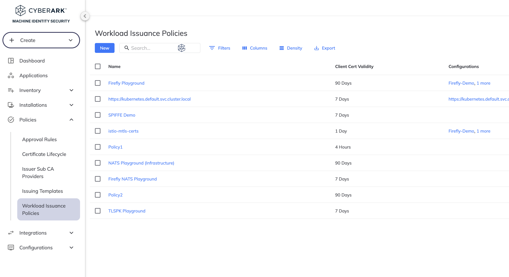
      </div>
      <div class="column">
      <caption>Example 2 :material-arrow-down-right:</caption>
        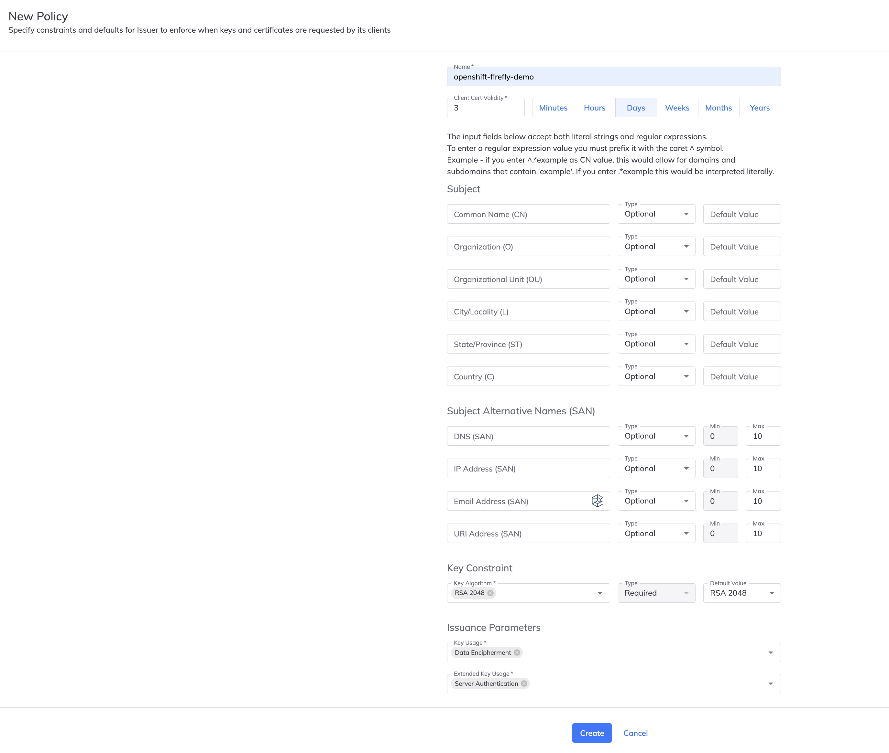
      </div>
           
      
    </div>


??? abstract "Step 5. Create a Firefly Configuration "

    In this step we will create Firefly configuration 
    
    1. Login to the Venafi Console and navigate to "Configurations - Issuer Configurations" (See Example 1.)
    2. Click "New" and complete the first part of the configuration (See Example 2.)
    3. Click "Continue" and complete the second part of the configuration (See Example 3.)

    <style>
    .row {
      display: flex;
    }

    .column {
      flex: 33.33%;
      padding: 5px;
    }
    </style>

    <div class="row">
      <div class="column">
      <caption>Example 1 :material-arrow-down-right:</caption>
        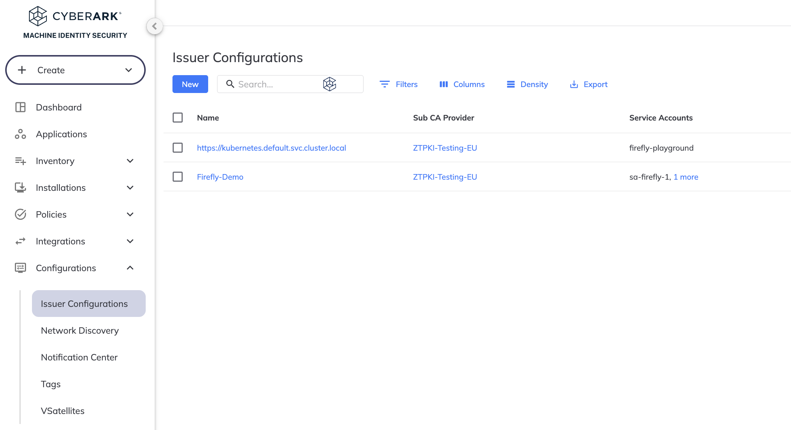
      </div>
      <div class="column">
      <caption>Example 2 :material-arrow-down-right:</caption>
        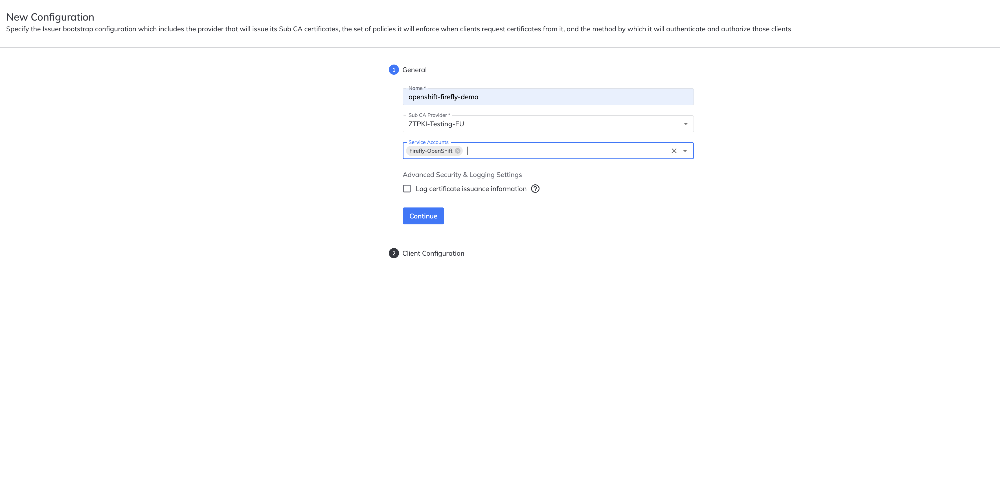
      </div>
           <div class="column">
           <caption>Example 3 :material-arrow-down-right:</caption>
        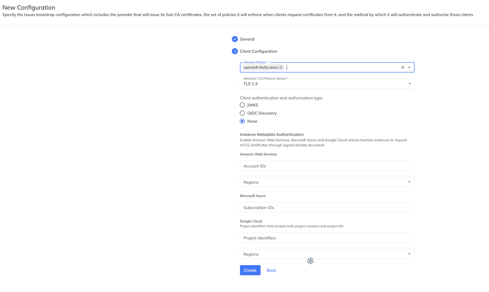
      </div>
      
    </div>


??? abstract "Step 6. Install CyberArk Workload Issuer (Firefly) "

    In this step we will install CyberArk Workload Issuer (Firefly) using the Venafi Operator 

    ```sh title="Command"
    kubectl apply -f - <<EOF
    apiVersion: installer.venafi.com/v1alpha1
    kind: VenafiInstall
    metadata:
      name: firefly-install
    spec:
      venafiConnection:
        install: true
      certManager:
        install: true
      globals:
        namespace: cyberark
        region: US
        imagePullSecretNames:
          - venafi-image-pull-secret
        vcpRegion: US
        enableDefaultApprover: true
      venafiEnhancedIssuer:
        install: false
        skip: true
      firefly:
        acceptTOS: true
        clientID: $CLIENT_ID
        install: true
        values:
          deployment:
            config:
              bootstrap:
                vaas:
                  url: https://api.venafi.cloud
              controller:
                certManager:
                  caRootChainPopulation: true    
    EOF

    ```


??? abstract "Step 7. Test the CyberArk Workload Issuer & cert-manager "

    In this step we will install CyberArk Workload Issuer (Firefly) using the Venafi Operator 


    ```sh title="Command" 
    kubectl apply -f - <<EOF
    kind: Certificate
    apiVersion: cert-manager.io/v1
    metadata:
      name: 6goats.acme.com
      namespace: cyberark
      annotations:
         firefly.venafi.com/policy-name: Firefly Playground
    spec:
      privateKey:
        rotationPolicy: Always
      secretName: 6goats.acme.com
      commonName: 6goats.acme.com
      issuerRef:
        name: firefly
        kind: Issuer
        group: firefly.venafi.com
    EOF
    ```


